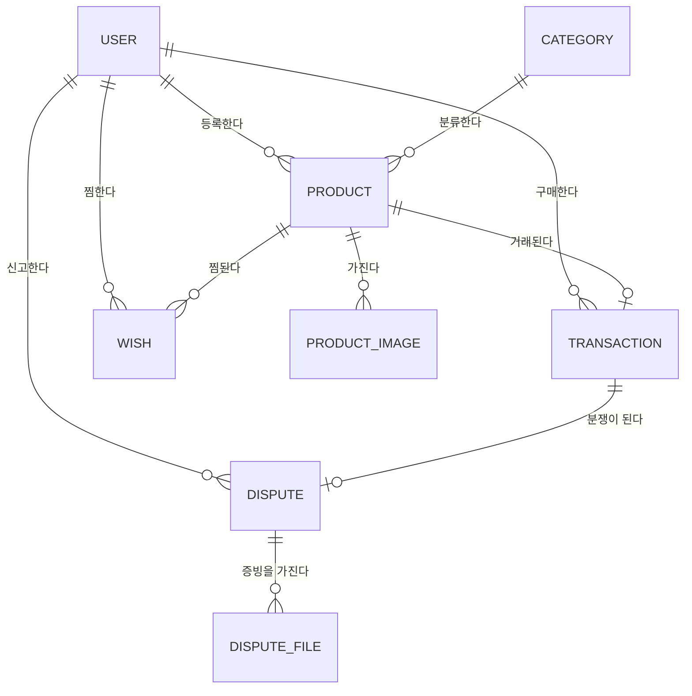

# 도메인 설계서 — UDT

## 문서 정보

| 항목 | 내용 |
|---|---|
| 프로젝트명 | UDT (Used Device Trade) |
| 문서 버전 | v0.1 |
| 작성일 | 2026-09-21 |
| 작성자 | (이름) |
| 최종 수정일 | 2026-09-21 |

> 정본: `SPEC.md` §1 · §2 · §5 · §9 — 이 문서는 파생본이다. 원본 개정 시 재발췌한다.
> 이 문서는 **업무 관점**이다. JPA 애노테이션·테이블 구조는 `02-Entity설계서.md`에 있다.

---

## 1. 프로젝트 개요

### 1.1 프로젝트 목적

개인 간 중고 전자기기 거래에서 발생하는 신뢰 문제 — 대금을 보내고 물건을 받지 못하거나,
게시된 사진과 다른 물건을 받는 상황 — 을 해결한다.

기존 중고거래가 **상품 정보 전달**에 집중한다면, UDT는 **거래가 거치는 상태**를 서비스의
중심에 둔다. 관리자 검수로 허위 매물을 사전에 거르고, 대금은 구매자가 물건을 확인하고
구매확정을 누르기 전까지 판매자에게 전달되지 않으며, 문제가 생기면 증빙을 근거로 관리자가
개입한다.

### 1.2 프로젝트 범위

**포함**

| 영역 | 내용 |
|---|---|
| 회원 | 가입 · 로그인 · 마이페이지 · 가상 잔액 |
| 상품 | 등록(사진 다중) · 검수 · 목록/검색/페이징 · 상세 · 찜 |
| 거래 | 구매 요청 · 배송 정보 · 구매 확정 · 정산 |
| 분쟁 | 증빙 첨부 신고 · 관리자 강제 환불/확정 |
| 관리 | 상품 검수 화면 · 분쟁 처리 화면 |

**제외 — 기간 대비 실현성 검토 결과**

| 제외 | 판단 근거 |
|---|---|
| 실시간 채팅 | 실시간 통신 도입 비용이 2주 일정에서 회수되지 않는다 |
| 실제 결제(PG) | 가맹 심사·정산 연동이 교육 프로젝트 범위를 벗어난다. **가상 잔액으로 동일한 상태 흐름을 구현**한다 |
| 알림·메일 | 외부 서비스 의존이 생기고 핵심 시나리오에 필수가 아니다 |
| 후기(Review) | 핵심 거래 흐름에 필수가 아니다. 우선순위 P2 |

### 1.3 주요 이해관계자

| 이해관계자 | 역할 | 주요 관심사 |
|---|---|---|
| 판매자 (MEMBER) | 상품 등록 · 배송 정보 입력 | 검수 통과로 얻는 신뢰 · 확실한 대금 수령 |
| 구매자 (MEMBER) | 구매 요청 · 구매 확정 · 분쟁 신고 | 물건을 확인하기 전 대금이 넘어가지 않는 안전장치 |
| 관리자 (ADMIN) | 상품 검수 · 분쟁 처리 | 허위 매물 차단 · 증빙 기반의 공정한 판단 |

---

## 2. 비즈니스 도메인 분석

### 2.1 핵심 비즈니스 프로세스

#### 프로세스 1 — 상품 등록과 검수

```
판매자 상품 등록 → [검수대기] → 관리자 검토 ┬→ 승인 → [판매중] → 목록 노출
                                          └→ 반려 → [반려] + 반려 사유
```

| 단계 | 수행자 | 결과 |
|---|---|---|
| 1 | 판매자 | 상품 정보와 사진(최대 5장) 등록 |
| 2 | 시스템 | 상태를 **검수대기**로 설정 · 목록에 노출하지 않음 |
| 3 | 관리자 | 관리 화면에서 승인 또는 반려 |
| 4 | 시스템 | 승인 시 **판매중**으로 전환하여 목록 노출 |

> 관련 규칙: BR-M001 · BR-P001 · BR-P002

#### 프로세스 2 — 거래 (에스크로)

```
구매 요청 → [결제완료] → 판매자 송장 입력 → [배송중] → 구매자 확정 → [구매확정]
    │                                                                      │
    └─ 구매자 잔액 차감 (즉시)                        판매자 잔액 증가 (이때 처음) ─┘
```

| 단계 | 수행자 | 결과 |
|---|---|---|
| 1 | 구매자 | 구매 요청 → 잔액 차감 · 상품 **거래중** · 거래 **결제완료** |
| 2 | 판매자 | 택배사·송장번호 입력 → 거래 **배송중** |
| 3 | 구매자 | 물건 확인 후 구매확정 → 거래 **구매확정** · 상품 **거래완료** · **판매자 잔액 증가** |

> **이 프로세스의 핵심은 3단계다.** 구매자의 돈은 1단계에서 빠지지만 판매자에게는
> 3단계에서야 들어간다. 그 사이에 떠 있는 금액이 이 서비스가 제공하는 안전장치다.
> 관련 규칙: BR-T001 ~ BR-T005

#### 프로세스 3 — 분쟁 처리

```
[결제완료|배송중] → 구매자 분쟁 신고(증빙 첨부) → [분쟁]
                                                   │
                            관리자 증빙 확인 ┬→ 강제 환불 → 구매자 잔액 복구 · 상품 판매중 복귀
                                            └→ 강제 확정 → 판매자 잔액 증가 · 상품 거래완료
```

> 관련 규칙: BR-D001 ~ BR-D003

### 2.2 비즈니스 이벤트

| 이벤트 | 트리거 | 결과 상태 변화 |
|---|---|---|
| 상품 등록됨 | 판매자 | 상품: (없음) → 검수대기 |
| 검수 승인됨 | 관리자 | 상품: 검수대기 → 판매중 |
| 검수 반려됨 | 관리자 | 상품: 검수대기 → 반려 (사유 기록) |
| 구매 요청됨 | 구매자 | 상품: 판매중 → 거래중 / 거래 생성(결제완료) / 구매자 잔액 −금액 |
| 배송 등록됨 | 판매자 | 거래: 결제완료 → 배송중 |
| 구매 확정됨 | 구매자 | 거래: 배송중 → 구매확정 / 상품: 거래중 → 거래완료 / 판매자 잔액 +금액 |
| 분쟁 접수됨 | 구매자 | 거래: → 분쟁 / 분쟁 생성(접수) |
| 분쟁 종결됨 | 관리자 | 거래: 분쟁 → 환불완료 또는 구매확정 / 잔액 정산 / 분쟁: → 종결 |

---

## 3. 핵심 도메인 객체

### 3.1 도메인 객체 식별 매트릭스

| 업무 이름 | 분류 | 설명 |
|---|---|---|
| 회원 | 핵심 엔티티 | 판매자와 구매자를 겸한다. 관리자도 회원의 한 종류 |
| 카테고리 | 보조 엔티티 | 상품 분류 기준 (노트북·스마트폰·태블릿·이어폰·기타) |
| 상품 | 핵심 엔티티 | 판매 대상. 검수 상태를 가진다 |
| 상품 사진 | 보조 엔티티 | 상품에 종속. 순서를 가진다 |
| 찜 | 조인 엔티티 | 회원과 상품의 다대다 관계를 표현 |
| 거래 | 핵심 엔티티 | 한 상품에 대해 최대 하나. 이 서비스의 중심 |
| 분쟁 | 핵심 엔티티 | 한 거래에 대해 최대 하나 |
| 증빙 파일 | 보조 엔티티 | 분쟁에 종속 |
| 회원 역할 | 값 객체(Enum) | 일반 회원 / 관리자 |
| 상품 상태 | 값 객체(Enum) | 검수대기·판매중·거래중·거래완료·반려 |
| 거래 상태 | 값 객체(Enum) | 결제완료·배송중·구매확정·분쟁·환불완료 |
| 상품 등급 | 값 객체(Enum) | S·A·B·C |

### 3.2 상세 도메인 객체 정의

#### 3.2.1 회원

| 항목 | 내용 |
|---|---|
| 정의 | 서비스를 이용하는 사람. 한 회원이 판매자와 구매자를 겸한다 |
| 주요 속성 | 이메일(고유) · 닉네임 · 역할 · **가상 잔액** |
| 주요 행동 | 출금(구매 시 차감) · 입금(판매 확정 시 증가) |
| 관련 규칙 | BR-M001 · BR-M002 · BR-T003 |

#### 3.2.2 상품

| 항목 | 내용 |
|---|---|
| 정의 | 판매자가 등록한 중고 전자기기. **검수를 통과해야 노출된다** |
| 주요 속성 | 제목 · 설명 · 가격 · 상태 등급 · 판매 상태 · 반려 사유 |
| 주요 행동 | 상태 전환 · 반려(사유 포함) · 사진 추가 |
| 관련 규칙 | BR-P001 ~ BR-P004 |

#### 3.2.3 거래

| 항목 | 내용 |
|---|---|
| 정의 | 한 상품에 대한 구매자와 판매자 사이의 한 번의 거래. **상품당 최대 하나** |
| 주요 속성 | 거래 금액 · 거래 상태 · 택배사 · 송장번호 · 확정 시각 |
| 주요 행동 | 배송 등록 · 구매 확정 · 상태 전환 |
| 관련 규칙 | BR-T001 ~ BR-T005 |

#### 3.2.4 분쟁

| 항목 | 내용 |
|---|---|
| 정의 | 거래 과정에서 발생한 문제의 공식 접수. **거래당 최대 하나** |
| 주요 속성 | 사유 · 처리 상태 · 관리자 메모 · 종결 시각 · 증빙 파일 |
| 주요 행동 | 증빙 첨부 · 종결 처리 |
| 관련 규칙 | BR-D001 ~ BR-D003 |

---

## 4. 도메인 관계도

### 4.1 개념적 관계도



### 4.2 관계 상세 설명

| 관계 | 다중성 | 설명 |
|---|---|---|
| 회원 — 상품 | 1 : N | 한 회원이 여러 상품을 등록한다 |
| 카테고리 — 상품 | 1 : N | 상품은 하나의 카테고리에 속한다 |
| 상품 — 상품사진 | 1 : N | 최대 5장. 순서를 가진다 |
| **회원 — 상품 (찜)** | **N : M** | 찜 엔티티로 표현. 같은 조합은 한 번만 |
| **상품 — 거래** | **1 : 1** | 판매 완료된 상품은 하나의 거래만 가진다 |
| **거래 — 분쟁** | **1 : 1** | 한 거래에 분쟁은 한 번만 접수된다 |
| 분쟁 — 증빙파일 | 1 : N | 최대 3개 |

---

## 5. 비즈니스 규칙

### 5.1 회원 관련 규칙

| ID | 규칙 | 검증 위치 |
|---|---|---|
| BR-M001 | 이메일은 중복될 수 없다 | `EMAIL_ALREADY_EXISTS` (409) |
| BR-M002 | 관리자 계정은 화면에서 생성하지 않는다 (초기 데이터로만 존재) | — |

### 5.2 상품 관련 규칙

| ID | 규칙 | 검증 위치 |
|---|---|---|
| BR-P001 | 등록 직후 상품은 **검수대기**이며 목록에 노출되지 않는다 | 등록 로직 |
| BR-P002 | 목록에는 **판매중** 상품만 노출한다 | 조회 조건 |
| BR-P003 | 사진은 최대 5장 · 각 5MB · jpg/png/webp만 허용 | `FILE_*` (400) |
| BR-P004 | 반려 시 사유는 필수다 | 관리자 폼 검증 |

### 5.3 거래 관련 규칙

| ID | 규칙 | 검증 위치 |
|---|---|---|
| BR-T001 | **판매중** 상태가 아닌 상품은 구매할 수 없다 | `PRODUCT_NOT_ON_SALE` (409) |
| BR-T002 | 본인이 등록한 상품은 구매할 수 없다 | `SELF_PURCHASE_NOT_ALLOWED` (400) |
| BR-T003 | 잔액이 상품 가격보다 적으면 구매할 수 없다 | `INSUFFICIENT_BALANCE` (400) |
| BR-T004 | 구매확정은 **구매자 본인**만, **배송중** 상태에서만 가능하다 | `TRANSACTION_FORBIDDEN` (403) · `INVALID_TRANSACTION_STATUS` (409) |
| BR-T005 | **판매자 잔액은 구매확정 시점에만 증가한다** | 확정 로직 (원자적) |

### 5.4 분쟁 관련 규칙

| ID | 규칙 | 검증 위치 |
|---|---|---|
| BR-D001 | 분쟁은 **결제완료·배송중** 상태에서만 접수할 수 있다 | `INVALID_TRANSACTION_STATUS` (409) |
| BR-D002 | 한 거래에 분쟁은 한 번만 접수된다 | `DISPUTE_ALREADY_EXISTS` (409) |
| BR-D003 | 강제 환불 시 상품은 **판매중**으로 복귀하고 구매자 잔액이 복구된다 | 관리자 처리 로직 (원자적) |

### 5.5 찜 관련 규칙

| ID | 규칙 | 검증 위치 |
|---|---|---|
| BR-W001 | 같은 회원이 같은 상품을 두 번 찜할 수 없다 | `WISH_ALREADY_EXISTS` (409) · DB 고유 제약 |

---

## 6. 용어 정의

| 업무 용어 | 영문(코드) | 정의 |
|---|---|---|
| 검수 | inspection | 관리자가 등록 상품의 노출 여부를 판단하는 절차 |
| 검수대기 | `INSPECTING` | 등록 직후, 아직 노출되지 않는 상태 |
| 판매중 | `ON_SALE` | 검수를 통과해 목록에 노출되는 상태 |
| 거래중 | `IN_TRADE` | 구매 요청이 접수되어 다른 사람이 살 수 없는 상태 |
| 거래완료 | `SOLD` | 구매확정으로 종료된 상태 |
| 정산 보류 | — | 결제는 되었으나 판매자에게 대금이 전달되지 않은 구간 |
| 구매확정 | `CONFIRMED` | 구매자가 수령을 인정해 대금이 판매자에게 넘어가는 시점 |
| 분쟁 | `DISPUTED` | 구매자가 문제를 제기해 관리자 판단을 기다리는 상태 |
| 강제 환불 | refund | 관리자가 구매자에게 대금을 돌려주는 처리 |
| 강제 확정 | force-confirm | 관리자가 판매자 편에서 거래를 종료하는 처리 |
| 찜 | wish | 관심 상품 표시 |
| 가상 잔액 | `balanceKrw` | 실제 결제 대신 사용하는 서비스 내 금액 |
| 상품 등급 | `conditionGrade` | 중고 상태 표기 (S·A·B·C) |
